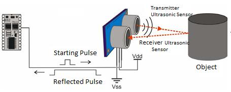
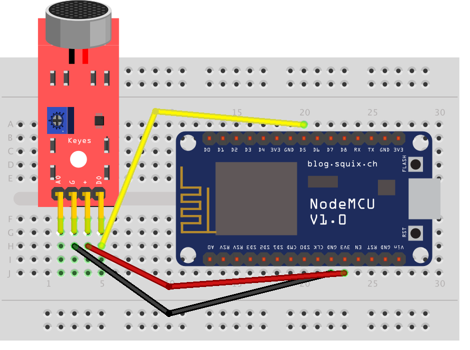

# Internet of Things Workshop @ Nirma University 2019
Refer this repository for the IoT Workshop at Nirma University organized under MESA's annual techno cultural colloquium, PRAVEG-2019.

<p align="center">

</p>

## Arduino IDE Installation
Arduino IDE is an integrated development environment where you can write your programs for all compatible development boards.
During the workshop we are going to use the <b>NodeMCU 1.0 (ESP-12E Module)</b>.
NodeMCU is based on the Esperessif ESP8266-12E WiFi System-On-Chip, loaded with an open-source, Lua-based firmware. it’s perfect for IoT applications, and other situations where wireless connectivity is required.

You are required to follow the given steps to get started with programming for this workshop.
1. Go to the following link to download and install the Arduino package for the correct platform.
   https://www.arduino.cc/en/main/software
   
2. Open the Arduino IDE and click on <b>File -> Preferences</b>.

3. In  <b>Aditional Boards Manager URLs</b> add this line and click on "OK":
   http://arduino.esp8266.com/stable/package_esp8266com_index.json
   
4. Go to <b>Tools -> Board -> Boards Manager</b>, type "ESP8266" and install <i>"esp8266 by ESP8266 Community"</i>.

5. Go again to <b>Tools -> Board</b> and select "<i>NodeMCU 1.0 (ESP-12E Module)</i>".

Once you complete all the steps, you are ready to start programming on the <b>NodeMCU</b>.

## Hello Arduino
Here is your first Arduino IDE code of LED blink on ESP8266 board.
```
int led = 2;  // built-in LED.
// the setup function runs only once.
void setup() {
  Serial.begin(115200); //Set data rate in bits per second (baud) for serial data transmission.
  pinMode(led, OUTPUT);  //Initialize built-in LED as an output.
  digitalWrite(led,HIGH); //Setup led as OFF.
}

// the loop function runs over and over again forever
void loop() {
  digitalWrite(led, LOW);                 // turn the LED on
  Serial.println("Built-in LED is ON");   //print on the serial monitor
  delay(1000);                            // wait for a second
  digitalWrite(led, HIGH);                // turn the LED off
  Serial.println("Built-in LED is OFF");  //print on the serial monitor
  delay(1000);                            // wait for a second
}
```
You can explore more such ready made codes in the well written <b>Built-in Example</b> section of your Arduino IDE present in <b>File Menu</b>.

## Installing MyMQTT app
In one of the practical you will be required to use MQTT protocol to send and receive messages. You are required to install an Android App for the same purpose.
Refer the link below.
> https://play.google.com/store/apps/details?id=at.tripwire.mqtt.client&hl=en_IN

## Tasks
- <b> Reverse Car Parking Sensor </b> 
   <br>Objective:<br>
   To implement real world reverse car parking sensor using Ultrasonic Sensor, Buzzer, LED and NODEMCU ESP8266. Also it, should be connected to a remote device like Mobile phone through WiFi. The device should function as follows

| Distance | LED | Buzzer |
| :---:         |     :---:      |          :---: |
| Distant   | All LEDs should remain OFF     | Silent    |
| Far     | 1 LED should turn ON       | Buzzer should beep at low frequency      |
| Near     | 2 LEDs should turn ON       | Buzzer should beep at medium frequency      |
| Close     | All LEDs should turn ON       | Buzzer should beep at high frequency      |

<br>
    The distance should also be visible on remote device connected to the microcontroller.
<p align="center">

</p>

- <b>Clap on Lights!</b>
  <br>Objective:<br> 
  To implement light automation system which turn on the Lights (LED) by clapping once and turns off after the second clap using microphone module and ESP8266 NodeMCU. It should work as an emergency alarm as well, if one claps fast, it should display an emergency message on the mobile phone and LEDs should blink. 
  
<p align="center">

</p>
  
- <b> Temperature and Pressure Mailing machine </b> <br>
  Objective:<br> To measure Pressure and Temprature using DHT11 sensor and ESP8266 NodeMCU, and sending the data to a defined email ID. The data should be visible on mobile phone in real time.
   <br>
   
<p align="center">

</p>

## Datasheets

1. Brief about <b> ESP 8266 NodeMCU </b> 
<br> https://www.handsontec.com/pdf_learn/esp8266-V10.pdf
2. <b> DHT11 Temperature and Pressure Sensor </b>
<br>https://www.mouser.com/ds/2/758/DHT11-Technical-Data-Sheet-Translated-Version-1143054.pdf
3. <b> Microphone Sensor Module KY-038</b>
<br>https://datasheetspdf.com/pdf-file/1402048/Joy-IT/KY-038/1
4. <b> Adafruit ESP8266EX</b>
<br>https://cdn-shop.adafruit.com/product-files/2471/0A-ESP8266__Datasheet__EN_v4.3.pdf
5. <b> Ultrasonic Sensor HC-SR04</b>
<br>https://datasheetspdf.com/pdf-file/1291829/Cytron/HC-SR04/1
6. <b> 5V Buzzer</b>
<br>http://www.farnell.com/datasheets/2171929.pdf


## For Your Reference
1. List of sensors available for Arduino module
  - https://www.thegeekpub.com/wiki/list-of-arduino-sensors-and-modules/

2. Cayenne App for Raspberry Pi Monitoring
  - Play store:
https://play.google.com/store/apps/details?id=com.mydevices.cayenne&hl=en_IN

  - App Store:
https://apps.apple.com/us/app/cayenne-iot-project-builder/id1057997711


